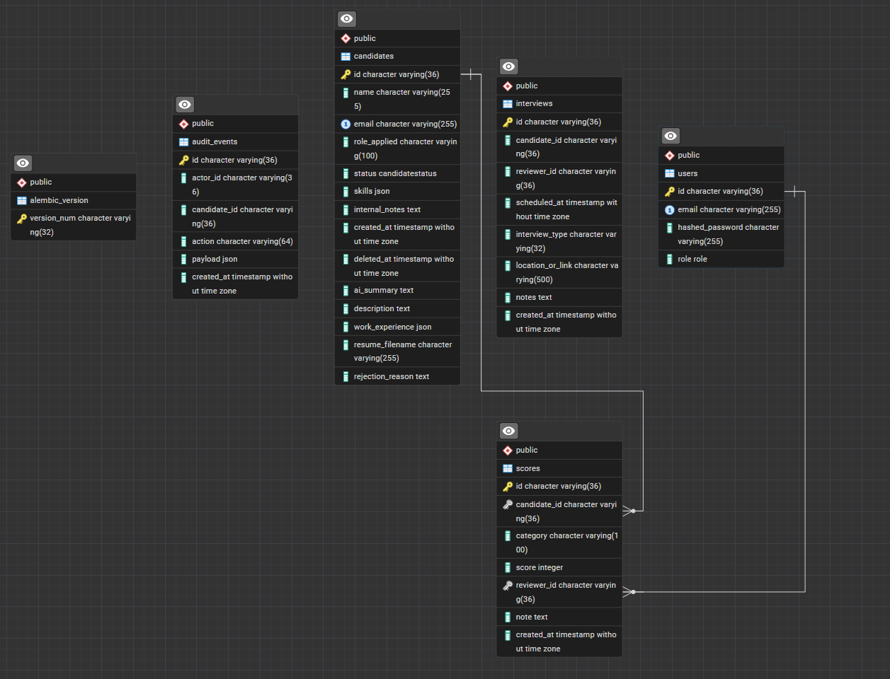

# TechKraft Candidate Scoring Dashboard

Internal candidate scoring and review dashboard for TechKraft's recruitment workflow.

**Live deployment:** [https://pywithaayush.tech](https://pywithaayush.tech)  
Hosted on Azure VM · HTTPS via Let's Encrypt · images built by GitHub Actions and pulled from ghcr.io.

---

## Stack

| Layer | Technologies |
|---|---|
| Backend | FastAPI, SQLAlchemy 2.x (async), Alembic, PostgreSQL, Redis, uv |
| Frontend | React 18, Vite, Tailwind CSS v4, Zustand, TanStack Query |
| Infra | Docker Compose (local) · Azure VM + nginx (production) |
| AI | GitHub Models API (`models.github.ai`) |

---

## Accounts & access

### Seeded accounts (after `python -m seed`)

These are created by `backend/app/seed.py` for local dev and first production deploy. **Change passwords in production.**

| Role | Email | Password | Permissions |
|---|---|---|---|
| **Admin** | `admin@techkraft.com` | `admin12345` | Hiring decisions, resume upload, internal notes, add/remove candidates, interviews, audit log |
| **Reviewer** | `reviewer1@techkraft.com` | `reviewer12345` | Submit scores, view own scores, generate AI summaries |
| **Reviewer** | `reviewer2@techkraft.com` | `reviewer12345` | Same as reviewer1 (tests multi-reviewer score isolation) |

Seed also loads **8 demo candidates** across `new`, `reviewed`, `hired`, and `rejected` statuses (James Okafor is pre-rejected with a sample reason).

### Self-registration (reviewer only)

- **UI:** Login page → register flow, or `POST /api/v1/auth/register`
- **Role:** Always `reviewer` — the API accepts only `email` + `password`; there is **no `role` field** and client-supplied roles are ignored
- **Admin accounts:** Seeded or created directly in the database — never via public registration

```bash
curl -X POST http://localhost:8000/api/v1/auth/register \
  -H "Content-Type: application/json" \
  -d '{"email":"new.reviewer@techkraft.com","password":"secret12345"}'
```

### Public apply (no auth)

Candidates can apply at [https://pywithaayush.tech/apply](https://pywithaayush.tech/apply) or via `POST /api/v1/applications` (rate-limited, optional resume upload).

---

## Quick start (Docker Compose)

```bash
cp .env.example .env
# Edit POSTGRES_PASSWORD and other values as needed
docker compose up --build
```

In a second terminal, run migrations:

```bash
docker compose exec backend uv run alembic upgrade head
```

Seed demo users and candidates (if the database is empty):

```bash
docker compose exec backend uv run python -m seed
```

| Service | URL |
|---|---|
| Frontend | http://localhost:5173 |
| Backend API | http://localhost:8000 |
| Health check | http://localhost:8000/health |
| PostgreSQL | localhost:5432 |
| Redis | localhost:6379 |

Stop services:

```bash
docker compose down
```

---

## Local development (without full Docker)

### 1. Start PostgreSQL and Redis

```bash
docker compose up db redis -d
```

### 2. Backend

```bash
cp .env.example .env
# Set POSTGRES_HOST=localhost and your POSTGRES_PASSWORD
cd backend
uv sync
uv run alembic upgrade head
uv run python -m seed
uv run uvicorn app.main:app --reload --host 0.0.0.0 --port 8000
```

### 3. Frontend

```bash
cd frontend
npm install
npm run dev
```

Open http://localhost:5173

> The Vite dev server proxies `/api` and `/health` to `http://localhost:8000` when `VITE_API_URL` is unset (see `frontend/vite.config.js`).

---

## Environment variables

Copy `.env.example` — **never commit real credentials**. All secrets go in `.env` (gitignored).

```env
POSTGRES_DB=take-home
POSTGRES_USER=postgres
POSTGRES_PASSWORD=your_password
POSTGRES_HOST=localhost   # use "db" in Docker Compose
POSTGRES_PORT=5432
REDIS_URL=redis://localhost:6379/0
SECRET_KEY=changeme
VITE_API_URL=http://localhost:8000
CORS_ORIGINS=http://localhost:5173,http://127.0.0.1:5173
```

### GitHub token (AI summaries)

1. [GitHub Settings → Personal access tokens](https://github.com/settings/tokens)
2. Create a token with **`models:read`** scope
3. Add to `.env`:

```env
GITHUB_TOKEN=ghp_your_token_here
GITHUB_MODEL=openai/gpt-4o
AI_SUMMARY_FALLBACK_MOCK=false
```

Without a token (or with `AI_SUMMARY_FALLBACK_MOCK=true`), the API uses a mock summary generator for local development.

### Email notifications (optional)

```env
EMAIL_ENABLED=true
SMTP_HOST=smtp.gmail.com
SMTP_PORT=587
SMTP_USE_TLS=true
SMTP_USER=your@gmail.com
SMTP_PASSWORD=your_app_password
SMTP_FROM=your@gmail.com
```

---

## Directory structure

```
techkraft/
├── .env.example
├── docker-compose.yml          # Local dev (Vite + hot reload)
├── docker-compose.prod.yml     # Production (ghcr.io images, memory limits)
├── deploy/
│   ├── deploy.sh               # Pull images, migrate, seed-if-empty, restart
│   ├── setup-vm.sh             # One-time Azure VM setup
│   ├── setup-https.sh          # Host nginx + Let's Encrypt
│   ├── nginx.conf              # In-container reverse proxy
│   └── nginx-host.conf         # Host-level reverse proxy
├── .github/workflows/
│   ├── ci.yml
│   └── deploy-azure.yml
├── backend/
│   ├── app/
│   │   ├── api/v1/
│   │   │   ├── auth/           # domain · application · infrastructure · presentation
│   │   │   ├── candidates/
│   │   │   ├── applications/   # Public apply
│   │   │   ├── interviews/
│   │   │   └── health/
│   │   ├── db/models/          # user, candidate, score, audit_event, interview
│   │   ├── shared/             # email, pagination, rate limiter, SSE
│   │   └── seed.py
│   ├── alembic/versions/
│   ├── tests/
│   └── Dockerfile
└── frontend/
    ├── src/
    │   ├── api/                # Axios client + endpoint modules
    │   ├── components/         # AISummaryPanel, ScoringForm, modals, …
    │   ├── hooks/              # TanStack Query hooks
    │   ├── pages/              # Login, list, detail, apply, interviews
    │   └── store/              # Zustand auth + toasts
    ├── Dockerfile              # Dev image
    └── Dockerfile.prod         # nginx static build
```

Each backend feature follows **domain → application → infrastructure → presentation** (vertical-slice / clean architecture).

---

## Entity relationship diagram

<!-- TODO: Replace with your ERD image -->



*ERD to be added. Core entities: `users`, `candidates`, `scores`, `audit_events`, `interviews`. Candidates soft-delete via `deleted_at`; scores belong to a candidate and reviewer (`users`).*

---

## API examples

```bash
# Login (seeded admin)
curl -X POST http://localhost:8000/api/v1/auth/login \
  -H "Content-Type: application/json" \
  -d '{"email":"admin@techkraft.com","password":"admin12345"}'

# List candidates (replace TOKEN)
curl "http://localhost:8000/api/v1/candidates?status=new&limit=20" \
  -H "Authorization: Bearer TOKEN"

# Submit score
curl -X POST http://localhost:8000/api/v1/candidates/CANDIDATE_ID/scores \
  -H "Authorization: Bearer TOKEN" \
  -H "Content-Type: application/json" \
  -d '{"category":"technical","score":4,"note":"Strong fundamentals"}'

# Generate AI summary
curl -X POST http://localhost:8000/api/v1/candidates/CANDIDATE_ID/summary \
  -H "Authorization: Bearer TOKEN"

# Admin: soft delete (sets deleted_at — never hard-deletes)
curl -X DELETE http://localhost:8000/api/v1/candidates/CANDIDATE_ID \
  -H "Authorization: Bearer ADMIN_TOKEN"

# Public application (multipart)
curl -X POST http://localhost:8000/api/v1/applications \
  -F "name=Alex Kim" \
  -F "email=alex@example.com" \
  -F "role_applied=Backend Engineer" \
  -F "skills=Python,FastAPI" \
  -F "resume=@./resume.pdf"
```

---

## Hiring workflow

```
NEW → REVIEWED → HIRED
              ↘ REJECTED (requires reason)
```

| Status | How it happens |
|---|---|
| **new** | Seed, admin "Add Candidate", or public `/apply` form |
| **reviewed** | **Automatically** when the first reviewer submits a score |
| **hired** | Admin sets status via Hiring Decision panel |
| **rejected** | Admin sets status + **mandatory rejection reason** (min 10 characters) |

**Reviewers** see only their own scores and never see internal notes or rejection reasons.  
**Admins** see all scores, internal notes, rejection reasons, resumes, audit log, and interviews.

### Soft delete

`DELETE /api/v1/candidates/{id}` sets `deleted_at` on the row — the record is retained for audit but returns **404** on subsequent reads. Implemented in `candidate_repository.soft_delete()`.

### Live score updates (SSE)

`GET /api/v1/candidates/{id}/stream` pushes score events when any reviewer submits. The detail page listens and refreshes automatically. Dev uses in-memory queues; production should use Redis pub/sub.

### AI summary UI states

`AISummaryPanel` uses TanStack Query `useMutation` and renders explicit states — not a blank panel while waiting:

| State | UI |
|---|---|
| **Loading** | Spinner + "Generating summary…" · Generate button disabled |
| **Error** | Red error panel with API message + **Retry** button |
| **Success** | Formatted summary paragraphs |
| **Empty** | Dashed placeholder before first generation |

---

## Debugging signal

The assignment snippet loads **every candidate into Python memory**, filters in-process, then slices for pagination:

```python
def search_candidates(status: str, keyword: str, page: int, page_size: int):
    all_candidates = db.execute("SELECT * FROM candidates").fetchall()
    filtered = [c for c in all_candidates if c["status"] == status]
    # ... also filter by keyword in Python ...
    offset = (page - 1) * page_size
    return filtered[offset : offset + page_size]
```

### What's wrong?

1. **Full table scan + load** — `SELECT *` with no `WHERE` pulls the entire table into application memory on every request. At 10k–100k rows this blows RAM, adds latency, and bypasses database indexes.
2. **Filter in Python** — status and keyword filtering should be SQL `WHERE` clauses so PostgreSQL can use indexes and return only matching rows.
3. **Broken pagination contract** — slicing a Python list after filtering gives no accurate `total` count, wrong page boundaries under concurrent writes, and inconsistent results if the in-memory list order differs from the DB.
4. **No soft-delete guard** — a naive `SELECT *` would include archived (`deleted_at IS NOT NULL`) candidates unless explicitly excluded.

### Correct approach (what this project does)

Push filters, count, and pagination into SQLAlchemy:

```python
where = and_(CandidateModel.deleted_at.is_(None), ...)
total = await session.scalar(select(func.count()).where(where))
rows = await session.scalars(
    select(CandidateModel).where(where)
    .order_by(CandidateModel.created_at.desc())
    .offset(offset).limit(limit)
)
return PaginatedResult(items=rows, total=total, offset=offset, limit=limit)
```

See `candidate_repository.list_filtered()` and `app/shared/pagination.py`.

---

## Architecture decision records

### ADR 1 — FastAPI + async SQLAlchemy over sync Django/Flask

| | |
|---|---|
| **Context** | Recruitment dashboard needs concurrent API calls (list, detail, SSE, AI inference) against PostgreSQL without blocking the event loop. |
| **Decision** | FastAPI with `asyncpg` + SQLAlchemy 2.x async sessions; Alembic for migrations. |
| **Trade-off** | Async complexity (session lifecycle, `await` everywhere) vs. higher throughput per worker and natural fit for external AI HTTP calls. |

### ADR 2 — Normalized schema with soft delete on candidates

| | |
|---|---|
| **Context** | Candidates accumulate scores, notes, audit events, and interviews; hiring teams must not lose history when a record is "removed." |
| **Decision** | Separate `users`, `candidates`, `scores`, `audit_events`, `interviews` tables. Candidates use `deleted_at` soft delete; list/detail queries always filter `deleted_at IS NULL`. |
| **Trade-off** | Slightly more complex queries vs. hard-delete safety, auditability, and reversible admin actions. |

### ADR 3 — JWT auth with server-enforced roles (no client role)

| | |
|---|---|
| **Context** | Reviewers and admins share the same app; role escalation via registration would be a critical security flaw. |
| **Decision** | `POST /register` accepts only `email` + `password` and **always** assigns `reviewer`. Role is embedded in the JWT at login and checked via FastAPI dependencies — never read from the request body on protected routes. |
| **Trade-off** | Admins must be seeded or provisioned out-of-band vs. preventing privilege escalation from the client. |

---

## Learning reflection

Deploying to a 1 GB Azure VM taught me to separate **build** (GitHub Actions on a 7 GB runner) from **run** (pull prebuilt images on the VM) — trying to `npm run build` on the VM exhausted swap and stalled deploys. I also integrated GitHub Models (`models.github.ai`) for real async AI summaries with a mock fallback, and wired SSE for live score updates — given more time I would move SSE to Redis pub/sub for multi-instance production and add integration tests for the interview email flow.

---

## Running tests

Tests use in-memory SQLite and fakeredis — no PostgreSQL or Redis required.

```bash
cd backend
uv sync --group dev
uv run pytest
```

Coverage includes SQL-level pagination totals, registration always creates `reviewer`, login rate limiting (429), soft delete → 404, and AI summary text normalization.

---

## Deploy to Azure (production)

| Artifact | Purpose |
|---|---|
| `deploy/setup-vm.sh` | One-time VM setup (Docker, swap) |
| `deploy/deploy.sh` | Pull images, migrate, auto-seed empty DB, restart |
| `deploy/setup-https.sh` | Host nginx + Let's Encrypt |
| `docker-compose.prod.yml` | Production compose (ghcr.io images) |
| `.github/workflows/deploy-azure.yml` | Build + SSH deploy on push to `main` |

Personal deployment notes live in `azure_deployed.md` / `deployed_azure.md` (both gitignored).

**Production URLs**

| Service | URL |
|---|---|
| App | https://pywithaayush.tech |
| Health (via nginx proxy) | https://pywithaayush.tech/health |

---

## Extension features

| Feature | Endpoint / route | Notes |
|---|---|---|
| Public apply | `POST /api/v1/applications`, `/apply` | No auth; rate-limited; optional resume |
| Email notifications | Status + interview hooks | Candidate + assigned reviewer; `EMAIL_ENABLED` + SMTP |
| Interview scheduling | `/api/v1/interviews`, `/interviews` | Admin calendar + per-candidate panel |
| Resume AI parse | `POST /api/v1/candidates/{id}/parse-resume` | PDF; mock or GitHub Models |
| Audit log | `GET /api/v1/candidates/{id}/audit` | Admin Activity tab |

---

## Known limitations

- SSE uses in-memory queues (not Redis pub/sub) — fine for single-instance, not multi-instance production
- Rate limiter uses a fixed Redis window, not a sliding-window Lua script
- Local Docker Compose runs the Vite dev server; production uses `Dockerfile.prod` + nginx
- Skill filter uses PostgreSQL JSON `contains` — not portable to SQLite/MySQL

---

## Responsibility & detail checks

| Requirement | How it's met |
|---|---|
| No committed credentials | `.env` gitignored; `.env.example` uses dummy values only |
| README ports match system | `5173` / `8000` / `5432` / `6379` per `docker-compose.yml` |
| No role spoofing at registration | `RegisterRequest` has no `role` field; service hard-codes `Role.REVIEWER` |
| Soft delete only | `DELETE` sets `deleted_at`; rows never hard-deleted |
| AI summary loading/error UI | `AISummaryPanel` — spinner, error panel, retry (not blank while waiting) |
| Tests included | `backend/tests/` — auth, candidates, summary normalization |

---

## Assignment requirements checklist

- [x] FastAPI backend with PostgreSQL and Redis
- [x] Candidate list with filters and SQL-backed pagination
- [x] Candidate detail with role-aware scores
- [x] Score submission API
- [x] AI summary generation (GitHub Models + mock fallback + loading/error UI)
- [x] Admin internal notes and soft delete (`deleted_at`)
- [x] React frontend with auth, list, and detail flows
- [x] Docker Compose for local development
- [x] pytest API tests
- [x] README: debugging signal, ADRs, learning reflection, directory structure
- [x] Live deployment at [pywithaayush.tech](https://pywithaayush.tech)

---

## Docker troubleshooting

If `uv run` inside the backend container fails with `.venv` / `email_validator` errors, the host bind-mount was likely overwriting the Linux virtualenv (common on Windows). This project uses a named Docker volume for `/app/.venv`. Recreate containers after pulling the fix:

```bash
docker compose down
docker compose up --build -d
docker compose exec backend uv run alembic upgrade head
```
